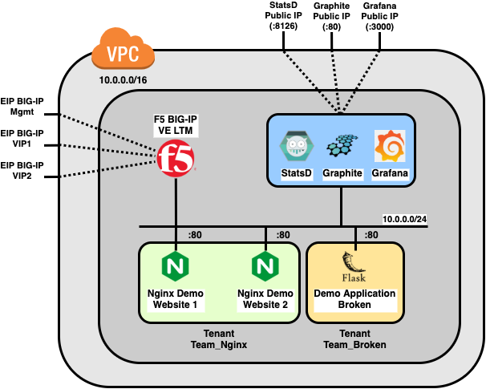

# AWS ATC TS Grafana Demo

## Introduction

This repository is a demonstation on how to use an F5 Networks BIG-IP in combination with StatsD, Graphite and Grafana for monitoring purposes. The Automation Tool Chain is used to configure the BIG-IP Virtual Edition inside AWS

The following setup is used 

For the sake of simplicity, we have chosen to deploy BIG-IP in a 1NIC configuration, inside one subnet only. In production environment, you might want to opt for a 2NIC or a 3NIC deploy to seperate public, private and management traffic

Terraform is used to create the network and spin up the necessary virtual machines (EC2 instances). The terraform code is divided into seperate modules for clarity reasons

 - **bigip:** spins up a BIG-IP Virtual Edition, using cloud init to provision the Automation Tool Chain RPMs (Declarative Onboarding, Application Services 3, Telemetry Streaming and Cloud Failover Extension). CFE is not used in this demo, but added for the sake of completeness
 - **graphite_grafana:** spins up an EC2 machine with 2 docker containers for Graphite/StatsD and Grafana
 - **network:** configure the AWS VPC and subnet
 - **security:** create a fresh EC2 key pair, create an AWS Secret Manager entry for the BIG-IP password and the necessary AWS Security Groups

In the second step, Anible is used to configure the BIG-IP and Grafana. The following roles are defined

 - **do:** Declarative Onboarding to initialise the BIG-IP in the network
 - **as3:** Application Services 3 to create the necessary virtual servers
 - **ts:** Telemetry Streaming to configure StatsD as a telemetry consumer
 - **grafana:** Configure the Graphite datasource and load the dashboard
 - **info:** Display some information about the setup and create a load generation script

In the AS3 part, three webservers are exposed using BIG-IP LTM Virtual Server functionality. The two Nginx hosted web applications are configured into 1 tenant/partition ***Team_Nginx***, a second demo web application written in Python3 Flask is configured in a seperate tenant/partition named ***Team_Broken***. This web application allows to control and generate bad/slow traffic. All application are in autodiscovery mode, menaing that based on predefined AWS tag key value pairs, BIG-IP will automatically populate the corresponding VS pools

The applications are configured and exposed as follows, using different AS3 configurations for demo purposes of how AS3 is a perfect match for declarative application exposure using BIG-IP ATC

| Application | Tenant/Partition | Server Pool | Profile | Exposed URL |
|---|---|---|---|---|
| NginxWebServerOne | Team_Nginx | NginxWebServerOnePool | Service_HTTP |  http://<EIP_BIG-IP_VIP1>:8080 |
| NginxWebServerTwo | Team_Nginx | NginxWebServerTwoPool | Service_HTTPS + WAF | https://<EIP_BIG-IP_VIP1>:8081 |
| BrokenWebServer | Team_Broken | BrokenWebServerPool | Service_HTTPS | https://<EIP_BIG-IP_VIP2>:8080 |

## Prerequisites

The following is a list of prerquirements needed on your host system before you can succesfully run this demo setup

 - AWS Market place BIG-IP subscription confirmation: in order to be able to use the BIG-IP VE on AWS, you will need to confirm a market place subscription
   - Go to [the AWS marketplace](https://console.aws.amazon.com/marketplace/home?#/search!mpSearch/search?text=F5+BIGIP-8%3D*PAYG*) and subscribe to the proper BIG-IP VE matching your *setup.yml* parameter value
   - You can also use BYOL, but the DO step would need some modification in order to use an existing license or a BIG-IQ provisioned license pool
 - Pre-installed SW
   - Ansible
   - Terraform
   - Make
   - Ansible F5 modules
   - Siege for traffic generation
   - AWS CLI to have the necessary boto3 dependencies

**Note:** installing or using make is not strictly necessary. You can also change directory to the terraform and ansible directories and execute the terraform and ansible-playbook executables manually. The makefile is only there for convience during a demo and avoid typos

## Usage

In order to make the initial configuration for this demo setup as straighfowards as possible, all necessary configuration parameters are externalized into a *setup.yml* file. Since this setup file will contain sensative information like credentials, an example *setup.change.yml* is provided in the root of this repository as an example. Make sure to change the necessary *changme* marked values to suit your needs

Next, all steps that are used to spinup the demo, are available as Makefile targets. This allows you tto go through the different parts of th demo

Terraform related targets include

 - **plan_infra:** perform the planning phase of Terraform. No actual infrastruture is being spun up at this phase
 - **deploy_infra:** perform the actual deployment of your Terrafrom plan
 - **destroy_infra:** destroy your infrastructure (do not forget this after a demo or a training)
 - **reset_infra:** destroy your infrastructure and start spinning up a fresh one from scratch

Ansible related targets include

 - **configure_bigip:** perform the DO/AS3/TS steps to configure BIG-IP 
 - **configure_grafana:** configure Graphite as a datasource and import the dashboard
 - **info:** print information of your setup (IP address, DNS names) and generate a bash based load script

 - **install_galaxy_modules:** install the two F5 Networks provided Ansible Galaxy modules used in this demo: 
   - `f5devcentral.atc_deploy` to perform DO/AS3/TS actions
   - `f5networks.f5_modules` to wait for BIG-IP to be ready after the terraform spin-up
 - **inventory:** generate a yaml file containing your AWS dynamic inventory file. This is not needed to run the demo, but essential for debugging and understanding of the variable herein referred inside the Ansible roles. When you run the Ansible playbook bigip, Ansible will generate this file in it's own cache in order to resolve the reference variables
 - **clean_output:** remove all temporary demo artifacts
 - **terraform_validate:** perform a syntax validation and linting step on the terraform code to maintain clean and readable code
 - **terraform_update:** update the terraform dependent modules
 - **bigip_payg_amis:** query the AWS API for the names of the BIG-IP AMIs, available in the AWS marketplace

 - **all:** do all necessary demo steps after each other
   - deploy_infra 
   - configure_bigip 
   - configure_grafana 
   - info

During the several stages of the demo, the `output` folder is being used to store all intermediate build artifacts. They can both be used for debugging and demonstration purposes, to understand and show what is happening under the hood

## Results

TODO (screenshots of the results and intermediate steps)

## Extra Information

More information on the F5 Automation Tool Chain Components can be found within the official documentation on F5 CloudDocs at

 - **DO:** https://clouddocs.f5.com/products/extensions/f5-declarative-onboarding/latest
 - **AS3:** https://clouddocs.f5.com/products/extensions/f5-appsvcs-extension/latest/
 - **TS:** https://clouddocs.f5.com/products/extensions/f5-telemetry-streaming/latest
 - **CFE:** https://clouddocs.f5.com/products/extensions/f5-cloud-failover/latest

The source code and public feature request tracking of the F5 Automation Tool Chain Components can be found on Github at

 - **DO:** https://github.com/F5Networks/f5-declarative-onboarding
 - **AS3:** https://github.com/F5Networks/f5-appsvcs-extension
 - **TS:** https://github.com/F5Networks/f5-telemetry-streaming
 - **CFE:** https://github.com/F5Networks/f5-cloud-failover-extension 

## Note

This repository is purely used for demo and educational purposes and not meant for production environments at all
