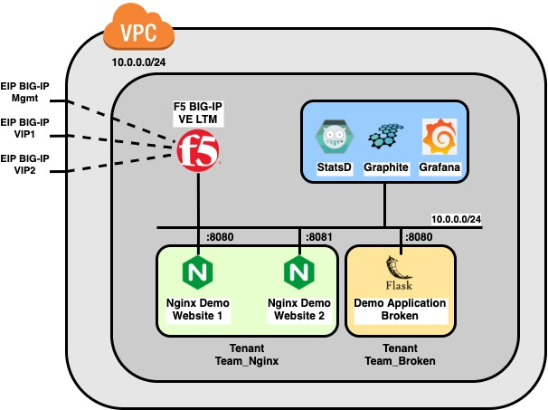

# AWS ATC TS Grafana Demo

## Introduction

This repository is a demonstation on how to use an F5 Networks BIG-IP in combination with StatsD, Graphite and Grafana for monitoring purposes. The Automation Tool Chain is used to configure the BIG-IP Virtual Edition inside AWS. 

The following setup is used 

Terraform is used to create the Network and spin up the necessary Virtual Machines (EC2 instances). The terraform is devided into seperate modules for clarity reasons

 - **bigip:** spins up a BIG-IP Virtual Edition, using cloud init to provision the Automation Tool Chain RPMs (Declarative Onboarding, Application Services 3, Telemetry Streaming and Cloud Failover Extension)
 - **graphite_grafana:** spins up an EC2 machine with 2 docker containers for Graphite/StatsD and Grafana
 - **network:** configure the VPC and Subnet
 - **security:** create a fresh EC2 key pair, create an AWS Secret Manager entry for the BIG-IP password and the necessary AWS Security Groups

In the second step, Anible is used to configure the BIG-IP and Grafana. The following roles are defined

 - **do:** Declarative Onboarding to initialise the BIG-IP in the network
 - **as3:** Application Services 3 to create the necessary virtual servers
 - **ts:** Telemtry Streaming to configure StatsD as a telemetry consumer
 - **grafana:** Configure the Graphite datasource and load the dashboard
 - **info:** Display some information about the setup and create a load generation script

In the AS3 part, 3 webservers are exposed using BIG-IP LTM Virtual Server funcionality. The two Nginx hosted web applications are configured into 1 tenant/partition *Team_Nginx*, a second demo web application written in Python3 Flask allows to control and generate bad/slow traffic

## Prerequisites

TODO

## Usage

In order to make the initial configuration for this demo setup as straighfowards as possible, all necessary configuration parameters are externalized into a *setup.yml* file. Since this setup file will contain sensative information like credentials, an example *setup.change.yml* is provided in the root of this repository as an example. Make sure to change the necessary *changme* marked values to suit your needs

Next, all steps that are used to spinup the demo, are available as Makefile targets. This allows you tto go through the different parts of th demo

Terraform related target include

 - **plan_infra:** perform the planning phase of Terraform. No actual infrastruture is being spun up at this phase
 - **deploy_infra:** perform the actual deployment of your Terrafrom plan
 - **destroy_infra:** destroy your infrastructure
 - **reset_infra:** destroy your infrastructure and start spin up a fresh one

Ansible related targets include

 - **configure_bigip:** perform the DO/AS3/TS steps to configure BIG-IP 
 - **configure_grafana:** configure Graphite as a datasource and import the dashboard
 - **info:** print information of your setup (IP address, DNS names) and generate a bask basec load script

 - **install_galaxy_modules:** install the two F5 Networks provided Ansible Galaxy modules using: `f5devcentral.atc_deploy` and `f5networks.f5_modules`
 - **inventory:** generate a yaml file containing your AWS dynamic inventory file. This is not needed to run the demo, but essential for debugging and understanding of the variable herein referred inside the Ansible roles
 - **clean_output:** remove all temporary demo artifacts
 - **terraform_validate:** perform a syntax validation and linting step on the terraform code to maintain clean and readable code
 - **terraform_update:** update the terraform dependant modules
 - **bigip_payg_amis:** query the AWS API for the names of the BIG-IP AMIs, available in the AWS marketplace

 - **all:** do all necessary demo steps after each other
   - deploy_infra 
   - configure_bigip 
   - configure_grafana 
   - info

During the several stages of the demo, the `output` folder is being used to store all intermediate build artifacts. They can be both used for debugging and demonstration purposes, to understand and show what is happening

## Results

## Extra Information

More information on the F5 Automation Tool Chain Components can be found within the official documentation on F5 CloudDocs at

 - **DO:** https://clouddocs.f5.com/products/extensions/f5-declarative-onboarding/latest
 - **AS3:** https://clouddocs.f5.com/products/extensions/f5-appsvcs-extension/latest/
 - **TS:** https://clouddocs.f5.com/products/extensions/f5-telemetry-streaming/latest
 - **CFE:** https://clouddocs.f5.com/products/extensions/f5-cloud-failover/latest

The source code and public feature request tracking of the F5 Automation Tool Chain Components can be found on Github at

 - **DO:** https://github.com/F5Networks/f5-declarative-onboarding
 - **AS3:** https://github.com/F5Networks/f5-appsvcs-extension
 - **TS:** https://github.com/F5Networks/f5-telemetry-streaming
 - **CFE:** https://github.com/F5Networks/f5-cloud-failover-extension 

## Note

This repository is purely used for demo and educational purposes and not meant for production environments at all
